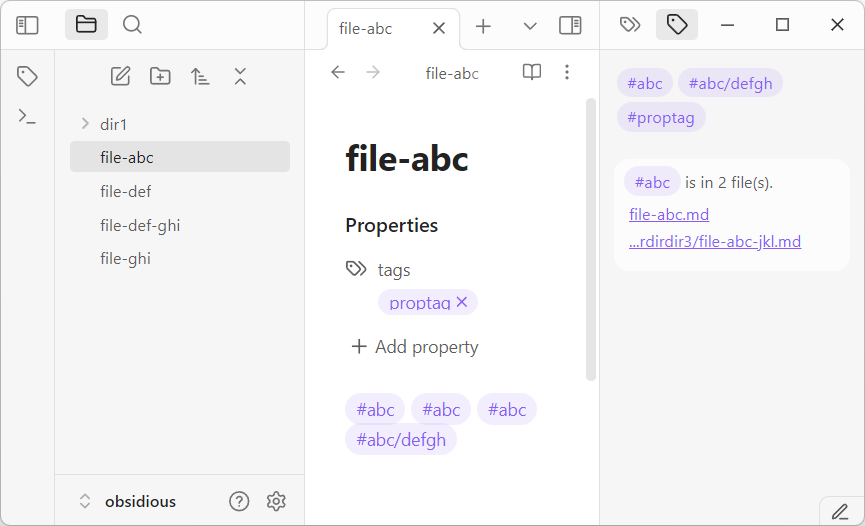

# Current File Tags

Display tags of the **active Markdown file** so you can have an overview of the tags being used.
- Show all tags in the file and frontmatter's "tags" property.
- Show all files containing a selected tag.
	- Click on the file to open it.
- Search a selected tag with the Obsidian Search plugin when Ctrl-clicked it (not mobile friendly).

## Installation

Please install from the Obsidian's Community Plugins tool.
1. Search for "Current File Tags" in Obsidian's Community Plugins tool.
2. Enable the plugin once installed.

## How to Use

After the plugin is installed and enabled, activate it on the right panel. Whenever you edit a Markdown file, the plugin will show the file's tags. Clicking on a tag will show all files containing that specific tag. To use the Search plugin to search a specific tag, hold down the `Ctrl` button and click on a specific tag.

## Development

See [https://github.com/trung-tran-swe/obsidian-current-file-tags](https://github.com/trung-tran-swe/obsidian-current-file-tags)

## Donations

This plugin is developed by [Trung Tran](https://github.com/trung-tran-swe) , and is free to use.

If you are in MA, I would love to meet up for a (free?) cup of coffee. If you wish to support virtually, please check out:

